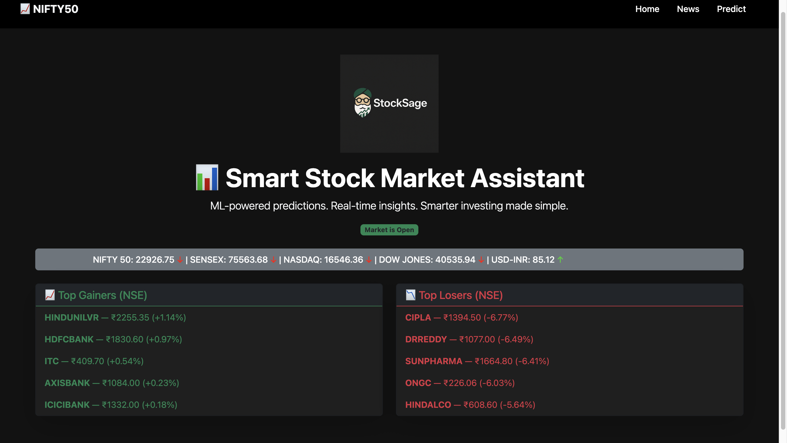
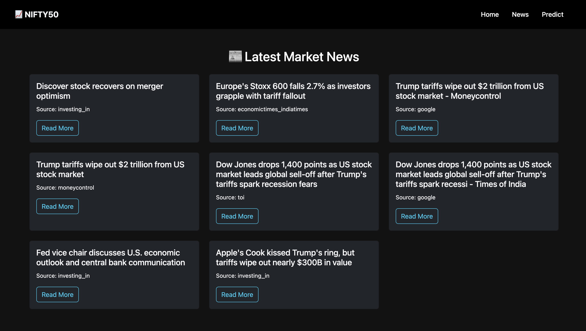
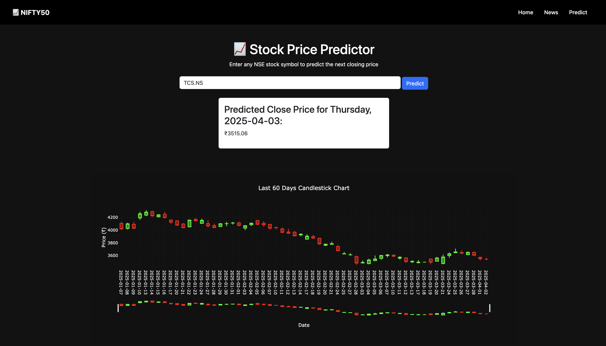

<p align="center">
  
</p>

# 📈 StockSage – Your Smart Stock Market Assistant

**StockSage** is a machine learning-powered stock market web app that predicts the next-day closing price of any NSE stock, aggregates live market news, and visualizes real-time data using interactive charts. Built using Flask, TensorFlow (GRU), yFinance, and Plotly with a clean Bootstrap-based UI.

---

## 🚀 Features

### 🔮 Intelligent Stock Predictions
- Predicts next-day **closing prices** using custom-trained **GRU models**
- Adds technical indicators like RSI, MACD, Bollinger Bands, ADX
- Auto-fetches 5 years of data from Yahoo Finance using `yfinance`

### 📰 Market News Aggregator
- Fetches top stock/business news from **NewsData.io**
- Displays clean, responsive news cards with titles, sources, and links

### 📊 Live Market Dashboard
- Live index ticker: NIFTY 50, SENSEX, NASDAQ, DOW JONES, USD-INR
- Shows **market open/closed** status (Indian hours)
- Highlights **Top 5 Gainers** and **Top 5 Losers** from NSE (NIFTY 50)

---

## 🧠 Tech Stack

| Layer        | Technology |
|--------------|------------|
| Backend      | Python, Flask, Blueprints |
| ML Modeling  | Keras, GRU, Scikit-learn |
| Data Sources | yFinance, NewsData.io |
| Frontend     | HTML, Jinja2, Bootstrap 5 |
| Visualization| Plotly.js (candlestick charts) |
| Deployment   | Render-ready Flask structure |

---

## 🗂️ Folder Structure

```
📦 StockSage/
├── app.py
├── routes/              # Flask blueprints
├── services/            # ML logic, training, utils
├── templates/           # HTML pages (Jinja2)
├── static/              # Bootstrap/CSS
├── storage/             # Saved models, scalers, raw CSVs
├── requirements.txt
└── README.md
```

---

## 🖼️ Screenshots

### 🏠 Home Dashboard  
Displays index ticker, top gainers/losers, and market status badge.  


---

### 📰 News Page  
Responsive layout of the top 8 business/market news headlines.  


---

### 📈 Prediction Page  
Enter an NSE stock symbol and get the predicted closing price with an interactive candlestick chart.  



---

## 🧪 How It Works

1. App checks if a model + scaler already exist for the given stock.
2. If not, it fetches 5 years of historical data and:
   - Adds indicators → Scales → Windows → Trains GRU → Saves model/scaler
3. At runtime, it loads the model and predicts the next closing price.
4. Inverse scales only the `Close` feature to show the actual rupee value.

---

## ⚙️ Run Locally

```bash
git clone https://github.com/rakshitshah280701/All_about_StockMarket.git
cd All_about_StockMarket
pip install -r requirements.txt
python app.py
```

Also, set your NewsData.io API key:
```bash
export NEWSDATA_API_KEY=your_api_key_here
```

---

## 🙋‍♂️ Author

**Rakshit Shah**  
📍 ML Engineer | Full-stack Developer  
🔗 [LinkedIn](https://www.linkedin.com/in/rakshitshah28)

---

## 📜 License

This project is licensed under the **MIT License**.


Built with ❤️ to make stock forecasting simpler and smarter.